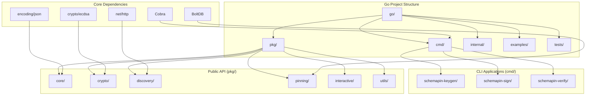

# SchemaPin Go Implementation Specification

## Executive Summary

This document provides a comprehensive specification for implementing SchemaPin in Go, ensuring feature parity with the existing Python and JavaScript implementations while following idiomatic Go patterns. SchemaPin is a cryptographic protocol for ensuring the integrity and authenticity of tool schemas used by AI agents, preventing "MCP Rug Pull" attacks through digital signatures and Trust-On-First-Use (TOFU) key pinning.

### Goals
- **Protocol Compatibility**: 100% interoperability with Python and JavaScript implementations
- **Idiomatic Go**: Natural Go patterns, error handling, and project structure
- **Zero Dependencies**: Pure Go implementation with single binary deployment
- **Professional CLI**: Rich command-line interface using industry-standard tools
- **Comprehensive Testing**: Full test coverage with cross-language compatibility validation

## Architecture Overview



### Key Design Decisions
- **Standard Go Layout**: `pkg/` for public APIs, `cmd/` for CLI tools
- **BoltDB Storage**: Pure Go key-value store for key pinning (no CGo)
- **Cobra CLI Framework**: Professional command-line interface
- **Protocol-First Compatibility**: Strict adherence to cryptographic specifications
- **Idiomatic Error Handling**: Go-style error patterns and wrapped errors

## Project Structure

```
go/
├── go.mod                              # Go module definition
├── go.sum                              # Dependency checksums
├── README.md                           # Go-specific documentation
├── LICENSE                             # MIT License
├── Makefile                            # Build automation
├── .gitignore                          # Git ignore patterns
├── .golangci.yml                       # Linting configuration
│
├── cmd/                                # CLI applications
│   ├── schemapin-keygen/
│   │   └── main.go                     # Key generation tool
│   ├── schemapin-sign/
│   │   └── main.go                     # Schema signing tool
│   └── schemapin-verify/
│       └── main.go                     # Schema verification tool
│
├── pkg/                                # Public API packages
│   ├── core/
│   │   ├── core.go                     # Schema canonicalization
│   │   └── core_test.go                # Core tests
│   ├── crypto/
│   │   ├── crypto.go                   # ECDSA operations
│   │   └── crypto_test.go              # Crypto tests
│   ├── discovery/
│   │   ├── discovery.go                # .well-known discovery
│   │   └── discovery_test.go           # Discovery tests
│   ├── pinning/
│   │   ├── pinning.go                  # Key pinning with BoltDB
│   │   └── pinning_test.go             # Pinning tests
│   ├── interactive/
│   │   ├── interactive.go              # User interaction
│   │   └── interactive_test.go         # Interactive tests
│   └── utils/
│       ├── utils.go                    # High-level workflows
│       └── utils_test.go               # Utils tests
│
├── internal/                           # Private packages
│   ├── testutil/
│   │   └── testutil.go                 # Test utilities
│   └── version/
│       └── version.go                  # Version information
│
├── examples/                           # Usage examples
│   ├── developer/
│   │   └── main.go                     # Tool developer example
│   ├── client/
│   │   └── main.go                     # Client verification example
│   └── interactive/
│       └── main.go                     # Interactive pinning demo
│
└── tests/                              # Integration tests
    ├── integration/
    │   ├── cross_compatibility_test.go # Cross-language tests
    │   └── cli_integration_test.go     # CLI integration tests
    └── fixtures/
        ├── test_keys/                  # Test key pairs
        ├── test_schemas/               # Test schemas
        └── test_well_known/            # Test .well-known files
```

## Detailed Component Specifications

### 1. Core Module (`pkg/core/`)

```go
package core

// SchemaPinCore provides schema canonicalization and hashing
type SchemaPinCore struct{}

func (s *SchemaPinCore) CanonicalizeSchema(schema map[string]interface{}) (string, error)
func (s *SchemaPinCore) HashCanonical(canonical string) []byte
func (s *SchemaPinCore) CanonicalizeAndHash(schema map[string]interface{}) ([]byte, error)
```

### 2. Crypto Module (`pkg/crypto/`)

```go
package crypto

// KeyManager handles ECDSA key operations
type KeyManager struct{}

func (k *KeyManager) GenerateKeypair() (*ecdsa.PrivateKey, error)
func (k *KeyManager) ExportPrivateKeyPEM(key *ecdsa.PrivateKey) (string, error)
func (k *KeyManager) ExportPublicKeyPEM(key *ecdsa.PublicKey) (string, error)
func (k *KeyManager) LoadPrivateKeyPEM(pemData string) (*ecdsa.PrivateKey, error)
func (k *KeyManager) LoadPublicKeyPEM(pemData string) (*ecdsa.PublicKey, error)
func (k *KeyManager) CalculateKeyFingerprint(key *ecdsa.PublicKey) (string, error)

// SignatureManager handles signature operations
type SignatureManager struct{}

func (s *SignatureManager) SignHash(hashBytes []byte, privateKey *ecdsa.PrivateKey) (string, error)
func (s *SignatureManager) VerifySignature(hashBytes []byte, signatureB64 string, publicKey *ecdsa.PublicKey) bool
func (s *SignatureManager) SignSchemaHash(schemaHash []byte, privateKey *ecdsa.PrivateKey) (string, error)
func (s *SignatureManager) VerifySchemaSignature(schemaHash []byte, signatureB64 string, publicKey *ecdsa.PublicKey) bool
```

### 3. Discovery Module (`pkg/discovery/`)

```go
package discovery

// WellKnownResponse represents .well-known/schemapin.json structure
type WellKnownResponse struct {
    SchemaVersion string   `json:"schema_version"`
    DeveloperName string   `json:"developer_name"`
    PublicKeyPEM  string   `json:"public_key_pem"`
    Contact       string   `json:"contact,omitempty"`
    RevokedKeys   []string `json:"revoked_keys,omitempty"`
}

// PublicKeyDiscovery handles .well-known endpoint discovery
type PublicKeyDiscovery struct{}

func NewPublicKeyDiscovery() *PublicKeyDiscovery
func (p *PublicKeyDiscovery) ConstructWellKnownURL(domain string) string
func (p *PublicKeyDiscovery) FetchWellKnown(ctx context.Context, domain string) (*WellKnownResponse, error)
func (p *PublicKeyDiscovery) GetPublicKeyPEM(ctx context.Context, domain string) (string, error)
func (p *PublicKeyDiscovery) ValidateKeyNotRevoked(ctx context.Context, publicKeyPEM, domain string) (bool, error)
func (p *PublicKeyDiscovery) GetDeveloperInfo(ctx context.Context, domain string) (map[string]string, error)
```

### 4. Pinning Module (`pkg/pinning/`)

```go
package pinning

// PinningMode and PinningPolicy enums
type PinningMode string
type PinningPolicy string

// PinnedKeyInfo represents stored key information
type PinnedKeyInfo struct {
    ToolID        string    `json:"tool_id"`
    PublicKeyPEM  string    `json:"public_key_pem"`
    Domain        string    `json:"domain"`
    DeveloperName string    `json:"developer_name,omitempty"`
    PinnedAt      time.Time `json:"pinned_at"`
    LastVerified  time.Time `json:"last_verified,omitempty"`
}

// KeyPinning manages TOFU key storage with BoltDB
type KeyPinning struct{}

func NewKeyPinning(dbPath string, mode PinningMode, handler interactive.InteractiveHandler) (*KeyPinning, error)
func (k *KeyPinning) Close() error
func (k *KeyPinning) PinKey(toolID, publicKeyPEM, domain, developerName string) error
func (k *KeyPinning) GetPinnedKey(toolID string) (string, error)
func (k *KeyPinning) IsKeyPinned(toolID string) bool
func (k *KeyPinning) UpdateLastVerified(toolID string) error
func (k *KeyPinning) SetDomainPolicy(domain string, policy PinningPolicy) error
func (k *KeyPinning) GetDomainPolicy(domain string) PinningPolicy
func (k *KeyPinning) InteractivePinKey(ctx context.Context, toolID, publicKeyPEM, domain, developerName string) (bool, error)
```

### 5. Interactive Module (`pkg/interactive/`)

```go
package interactive

// PromptType and UserDecision enums
type PromptType string
type UserDecision string

// KeyInfo represents key information for display
type KeyInfo struct {
    Fingerprint   string
    PEMData       string
    Domain        string
    DeveloperName string
    PinnedAt      time.Time
    LastVerified  time.Time
    IsRevoked     bool
}

// PromptContext provides context for interactive prompts
type PromptContext struct {
    PromptType      PromptType
    ToolID          string
    Domain          string
    CurrentKey      *KeyInfo
    NewKey          *KeyInfo
    DeveloperInfo   map[string]string
    SecurityWarning string
}

// InteractiveHandler interface for user interaction
type InteractiveHandler interface {
    PromptUser(context *PromptContext) (UserDecision, error)
    DisplayKeyInfo(keyInfo *KeyInfo) string
    DisplaySecurityWarning(warning string)
}

// ConsoleInteractiveHandler implements console-based interaction
type ConsoleInteractiveHandler struct{}

// CallbackInteractiveHandler implements callback-based interaction
type CallbackInteractiveHandler struct{}

// InteractivePinningManager manages interactive key pinning
type InteractivePinningManager struct{}

func NewInteractivePinningManager(handler InteractiveHandler) *InteractivePinningManager
func (i *InteractivePinningManager) PromptFirstTimeKey(toolID, domain, publicKeyPEM string, developerInfo map[string]string) (UserDecision, error)
func (i *InteractivePinningManager) PromptKeyChange(toolID, domain, currentKeyPEM, newKeyPEM string, currentKeyInfo map[string]interface{}, developerInfo map[string]string) (UserDecision, error)
func (i *InteractivePinningManager) PromptRevokedKey(toolID, domain, revokedKeyPEM string, keyInfo map[string]string) (UserDecision, error)
```

### 6. Utils Module (`pkg/utils/`)

```go
package utils

// SchemaSigningWorkflow provides high-level signing operations
type SchemaSigningWorkflow struct{}

func NewSchemaSigningWorkflow(privateKeyPEM string) (*SchemaSigningWorkflow, error)
func (s *SchemaSigningWorkflow) SignSchema(schema map[string]interface{}) (string, error)

// SchemaVerificationWorkflow provides high-level verification operations
type SchemaVerificationWorkflow struct{}

func NewSchemaVerificationWorkflow(pinningDBPath string) (*SchemaVerificationWorkflow, error)
func (s *SchemaVerificationWorkflow) VerifySchema(ctx context.Context, schema map[string]interface{}, signatureB64, toolID, domain string, autoPin bool) (map[string]interface{}, error)
func (s *SchemaVerificationWorkflow) PinKeyForTool(ctx context.Context, toolID, domain, developerName string) error

// CreateWellKnownResponse creates .well-known response structure
func CreateWellKnownResponse(publicKeyPEM, developerName, contact string, revokedKeys []string, schemaVersion string) map[string]interface{}
```

## CLI Tool Specifications

### schemapin-keygen

```bash
# Generate ECDSA key pair with .well-known template
schemapin-keygen --type ecdsa --output-dir ./keys --developer "Alice Corp" --well-known

# Generate RSA key pair with custom size
schemapin-keygen --type rsa --key-size 4096 --output-dir ./keys

# Generate with contact information
schemapin-keygen --type ecdsa --developer "Bob Inc" --contact "security@bob.com" --well-known
```

**Flags:**
- `--type`: Key type (ecdsa, rsa) [default: ecdsa]
- `--key-size`: RSA key size (2048, 3072, 4096) [default: 2048]
- `--output-dir`: Output directory [default: current directory]
- `--prefix`: Filename prefix [default: schemapin]
- `--developer`: Developer name for .well-known template
- `--contact`: Contact information
- `--schema-version`: Schema version [default: 1.1]
- `--well-known`: Generate .well-known template
- `--verbose, -v`: Verbose output
- `--quiet, -q`: Quiet output
- `--json`: JSON output format

### schemapin-sign

```bash
# Sign single schema
schemapin-sign --key private.pem --schema schema.json --output signed_schema.json

# Sign with metadata
schemapin-sign --key private.pem --schema schema.json --developer "Alice Corp" --version "1.0"

# Batch signing
schemapin-sign --key private.pem --batch schemas/ --output-dir signed/

# Sign from stdin
echo '{"type": "object"}' | schemapin-sign --key private.pem --stdin
```

**Flags:**
- `--key`: Private key file (PEM format) [required]
- `--schema`: Input schema file
- `--batch`: Directory for batch processing
- `--stdin`: Read from stdin
- `--output`: Output file
- `--output-dir`: Output directory for batch
- `--developer`: Developer name metadata
- `--version`: Schema version metadata
- `--description`: Schema description
- `--metadata`: JSON metadata file
- `--pattern`: File pattern for batch [default: *.json]
- `--suffix`: Output suffix [default: _signed]
- `--no-validate`: Skip schema validation
- `--verbose, -v`: Verbose output
- `--quiet, -q`: Quiet output
- `--json`: JSON output format

### schemapin-verify

```bash
# Verify with public key
schemapin-verify --schema signed_schema.json --public-key public.pem

# Verify with discovery
schemapin-verify --schema signed_schema.json --domain example.com --tool-id my-tool

# Interactive verification
schemapin-verify --schema signed_schema.json --domain example.com --tool-id my-tool --interactive

# Batch verification
schemapin-verify --batch schemas/ --domain example.com --auto-pin
```

**Flags:**
- `--schema`: Signed schema file
- `--batch`: Directory for batch processing
- `--stdin`: Read from stdin
- `--public-key`: Public key file (PEM format)
- `--domain`: Domain for discovery
- `--tool-id`: Tool identifier for pinning
- `--pinning-db`: Pinning database path
- `--interactive`: Interactive pinning mode
- `--auto-pin`: Auto-pin keys on first use
- `--pattern`: File pattern for batch [default: *.json]
- `--verbose, -v`: Verbose output
- `--quiet, -q`: Quiet output
- `--json`: JSON output format
- `--exit-code`: Exit with error code on failure

## Implementation Guidelines

### Go-Specific Patterns

1. **Error Handling**: Use wrapped errors with `fmt.Errorf` and `%w` verb
2. **Context Propagation**: Pass `context.Context` for cancellation and timeouts
3. **Interface Design**: Small, focused interfaces following Go conventions
4. **Package Organization**: Clear separation of concerns with minimal dependencies
5. **Testing**: Table-driven tests with comprehensive coverage
6. **Documentation**: Godoc comments for all exported functions and types

### Dependencies

```go
// go.mod
module github.com/thirdkey/schemapin

go 1.21

require (
    github.com/spf13/cobra v1.8.0
    go.etcd.io/bbolt v1.3.8
)

require (
    github.com/inconshreveable/mousetrap v1.1.0 // indirect
    github.com/spf13/pflag v1.0.5 // indirect
    golang.org/x/sys v0.4.0 // indirect
)
```

### Build Configuration

```makefile
# Makefile
.PHONY: build test lint clean install

BINARY_NAME=schemapin
VERSION=$(shell git describe --tags --always --dirty)
LDFLAGS=-ldflags "-X github.com/thirdkey/schemapin/internal/version.Version=$(VERSION)"

build:
	go build $(LDFLAGS) -o bin/schemapin-keygen ./cmd/schemapin-keygen
	go build $(LDFLAGS) -o bin/schemapin-sign ./cmd/schemapin-sign
	go build $(LDFLAGS) -o bin/schemapin-verify ./cmd/schemapin-verify

test:
	go test -v -race -coverprofile=coverage.out ./...

lint:
	golangci-lint run

clean:
	rm -rf bin/ coverage.out

install:
	go install $(LDFLAGS) ./cmd/...
```

## Testing Strategy

### Unit Tests
- **Coverage Target**: >90% for all packages
- **Test Structure**: Table-driven tests with subtests
- **Mocking**: Interface-based mocking for external dependencies
- **Test Data**: Fixtures in `tests/fixtures/` directory

### Integration Tests
- **Cross-Language Compatibility**: Verify interoperability with Python/JavaScript
- **CLI Integration**: End-to-end testing of command-line tools
- **Database Integration**: BoltDB operations and migrations
- **Network Integration**: HTTP client behavior and timeouts

### Security Tests
- **Cryptographic Validation**: ECDSA signature compatibility
- **Key Format Validation**: PEM encoding/decoding correctness
- **Protocol Compliance**: .well-known endpoint format validation
- **Error Handling**: Security-sensitive error scenarios

### Performance Tests
- **Benchmarks**: Core operations (canonicalization, signing, verification)
- **Memory Usage**: Profiling for memory leaks and efficiency
- **Concurrency**: Thread safety and concurrent access patterns

## Cross-Language Compatibility

### Protocol Requirements
1. **JSON Canonicalization**: Identical key sorting and serialization
2. **ECDSA Signatures**: Compatible ASN.1 DER encoding
3. **Key Fingerprints**: SHA-256 of DER-encoded public keys
4. **Well-Known Format**: Exact JSON structure matching
5. **Database Schema**: Interoperable key storage format

### Validation Tests
```go
// Cross-compatibility test example
func TestCrossLanguageCompatibility(t *testing.T) {
    tests := []struct {
        name           string
        pythonSigned   string
        jsSigned       string
        expectedValid  bool
    }{
        {
            name:          "python_signed_schema",
            pythonSigned:  "fixtures/python_signed.json",
            expectedValid: true,
        },
        {
            name:          "js_signed_schema", 
            jsSigned:      "fixtures/js_signed.json",
            expectedValid: true,
        },
    }
    
    for _, tt := range tests {
        t.Run(tt.name, func(t *testing.T) {
            // Test Go can verify Python/JS signatures
            // Test Python/JS can verify Go signatures
        })
    }
}
```

## Development Roadmap

### Phase 1: Core Implementation (Week 1-2)
- [ ] Project structure setup with Go modules
- [ ] Core module: JSON canonicalization and hashing
- [ ] Crypto module: ECDSA key management and signatures
- [ ] Basic unit tests with >80% coverage

### Phase 2: Discovery and Storage (Week 3)
- [ ] Discovery module: .well-known endpoint handling
- [ ] Pinning module: BoltDB-based key storage
- [ ] Integration tests for HTTP and database operations

### Phase 3: Interactive Features (Week 4)
- [ ] Interactive module: User prompt system
- [ ] Console and callback handlers
- [ ] Interactive pinning workflows

### Phase 4: CLI Tools (Week 5)
- [ ] schemapin-keygen: Key generation tool
- [ ] schemapin-sign: Schema signing tool
- [ ] schemapin-verify: Schema verification tool
- [ ] CLI integration tests

### Phase 5: Cross-Language Testing (Week 6)
- [ ] Cross-compatibility test suite
- [ ] Python/JavaScript interoperability validation
- [ ] Performance benchmarking
- [ ] Documentation and examples

### Phase 6: Production Readiness (Week 7)
- [ ] Security audit and testing
- [ ] Error handling improvements
- [ ] Documentation completion
- [ ] Release preparation

## Success Criteria

1. **Functional Parity**: All features from Python/JavaScript implementations
2. **Protocol Compatibility**: 100% interoperability across languages
3. **Test Coverage**: >90% unit test coverage, comprehensive integration tests
4. **Performance**: Comparable or better performance than existing implementations
5. **Usability**: Intuitive CLI tools with comprehensive help and examples
6. **Documentation**: Complete API documentation and usage guides
7. **Security**: Cryptographic operations validated and secure by default

This specification provides a comprehensive roadmap for implementing SchemaPin in Go while maintaining strict compatibility with existing implementations and following Go best practices.