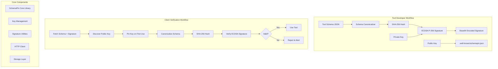
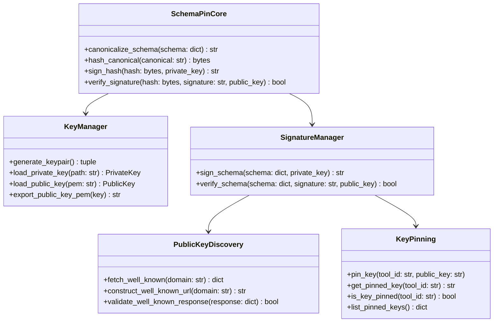

# SchemaPin Reference Implementation Plan

## 1. System Architecture Overview

The SchemaPin reference implementation will demonstrate cross-language interoperability with both Python and JavaScript implementations, showcasing the complete workflow from tool developer signing to client verification.



## 2. Core Components Architecture



## 3. Technology Stack

### Python Implementation
- **Core Crypto**: `cryptography` library (ECDSA P-256, SHA-256)
- **HTTP Client**: `requests` for .well-known discovery
- **JSON**: Built-in `json` module with custom canonicalization
- **Storage**: `sqlite3` for key pinning persistence
- **Testing**: `pytest` with crypto test vectors

### JavaScript Implementation  
- **Core Crypto**: Node.js `crypto` module (ECDSA P-256, SHA-256)
- **HTTP Client**: `fetch` API or `axios` for .well-known discovery
- **JSON**: Built-in JSON with custom canonicalization
- **Storage**: `sqlite3` or JSON file for key pinning
- **Testing**: `jest` with matching test vectors

### Shared Components
- **Test Vectors**: Cross-language compatibility test suite
- **Example Schemas**: Sample tool schemas for testing
- **Documentation**: API docs and usage examples

## 4. Project Structure

```
SchemaPin/
├── README.md
├── TECHNICAL_SPECIFICATION.md
├── IMPLEMENTATION_PLAN.md
├── LICENSE
├── .gitignore
├── docs/
│   ├── api-reference.md
│   ├── examples.md
│   └── security-considerations.md
├── python/
│   ├── schemapin/
│   │   ├── __init__.py
│   │   ├── core.py
│   │   ├── crypto.py
│   │   ├── discovery.py
│   │   ├── pinning.py
│   │   └── utils.py
│   ├── examples/
│   │   ├── tool_developer.py
│   │   ├── client_verification.py
│   │   └── sample_schemas/
│   ├── tests/
│   │   ├── test_core.py
│   │   ├── test_crypto.py
│   │   └── test_vectors.py
│   ├── requirements.txt
│   └── setup.py
├── javascript/
│   ├── src/
│   │   ├── index.js
│   │   ├── core.js
│   │   ├── crypto.js
│   │   ├── discovery.js
│   │   ├── pinning.js
│   │   └── utils.js
│   ├── examples/
│   │   ├── tool-developer.js
│   │   ├── client-verification.js
│   │   └── sample-schemas/
│   ├── tests/
│   │   ├── core.test.js
│   │   ├── crypto.test.js
│   │   └── test-vectors.test.js
│   ├── package.json
│   └── package-lock.json
├── test-vectors/
│   ├── schemas.json
│   ├── signatures.json
│   └── keys.json
├── examples/
│   ├── well-known-server/
│   │   ├── server.py
│   │   └── static/.well-known/schemapin.json
│   └── integration-demo/
│       ├── demo-tool-server.py
│       └── demo-client.py
└── tools/
    ├── keygen.py
    ├── schema-signer.py
    └── verify-schema.py
```

## 5. Implementation Phases

### Phase 1: Core Cryptographic Foundation (Week 1)
**Python Implementation:**
- Schema canonicalization engine
- SHA-256 hashing utilities  
- ECDSA P-256 key generation/management
- Signature creation and verification
- Comprehensive test suite with known test vectors

**JavaScript Implementation:**
- Mirror Python functionality using Node.js crypto
- Ensure identical canonicalization results
- Cross-language test vector validation

### Phase 2: Public Key Discovery & Pinning (Week 2)
**Both Languages:**
- .well-known URI construction and fetching
- Public key discovery client
- Key pinning storage mechanism
- First-use key pinning workflow
- Error handling for network failures

### Phase 3: Integration Layer (Week 3)
**High-Level APIs:**
- Tool developer signing workflow
- Client verification workflow  
- Configuration management
- Logging and debugging utilities

**Example Applications:**
- Command-line tool signer
- Schema verification utility
- Sample .well-known server

### Phase 4: Documentation & Examples (Week 4)
**Documentation:**
- API reference documentation
- Security best practices guide
- Integration examples

**Demo Applications:**
- Complete tool developer workflow
- Client verification demonstration
- Cross-language interoperability demo

## 6. Key Technical Challenges & Mitigation

### Challenge 1: Schema Canonicalization Consistency
**Risk**: Different JSON serialization across languages
**Mitigation**: 
- Implement strict canonicalization rules
- Extensive cross-language test vectors
- Reference canonical strings for validation

### Challenge 2: Cryptographic Compatibility
**Risk**: ECDSA signature differences between implementations
**Mitigation**:
- Use standard P-256 curve parameters
- Test with known signature vectors
- Validate against OpenSSL reference

### Challenge 3: Key Pinning Security
**Risk**: TOFU (Trust On First Use) vulnerabilities
**Mitigation**:
- Clear user prompts for key pinning
- Key fingerprint display
- Audit logging for key changes

### Challenge 4: Network Security
**Risk**: .well-known endpoint compromise
**Mitigation**:
- HTTPS enforcement
- Certificate pinning recommendations
- Fallback to cached keys

## 7. Testing Strategy

### Unit Testing
- Individual component testing
- Cryptographic primitive validation
- Error condition handling

### Integration Testing  
- End-to-end workflow testing
- Cross-language compatibility
- Network failure scenarios

### Security Testing
- Known attack vector validation
- Malformed input handling
- Timing attack resistance

### Performance Testing
- Large schema handling
- Signature verification speed
- Memory usage profiling

## 8. Success Criteria

1. **Functional Completeness**: Both Python and JavaScript implementations pass identical test suites
2. **Cross-Language Compatibility**: Signatures created in one language verify correctly in the other
3. **Security Compliance**: Implementation follows all TECHNICAL_SPECIFICATION.md requirements
4. **Usability**: Clear examples demonstrate both developer and client workflows
5. **Documentation**: Comprehensive guides enable third-party integration

## 9. Next Steps

This implementation plan provides a comprehensive roadmap for creating a reference SchemaPin implementation that demonstrates the protocol's security benefits while maintaining simplicity and cross-language compatibility. The phased approach ensures steady progress while allowing for iterative testing and refinement.

The reference implementation will serve as:
- A proof-of-concept for the SchemaPin protocol
- A foundation for production implementations
- Educational material for developers
- A test suite for protocol compliance