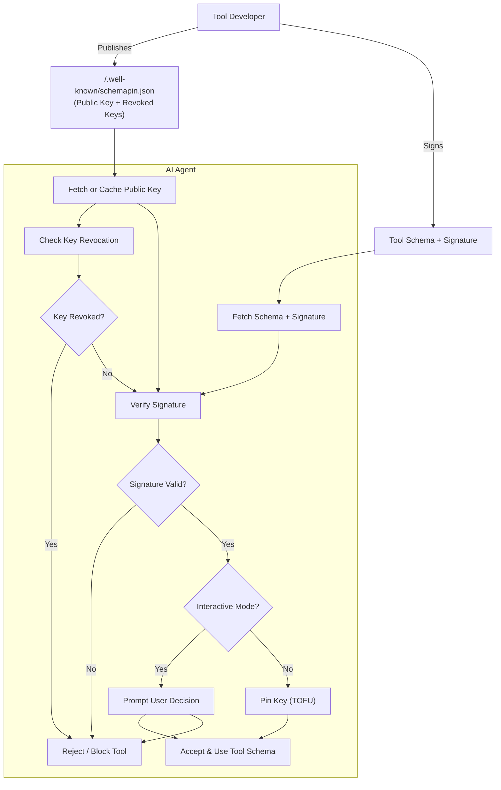
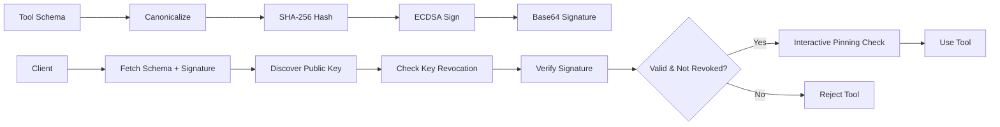

# SchemaPin 🧷

A cryptographic protocol for ensuring the integrity and authenticity of tool schemas used by AI agents. SchemaPin prevents "MCP Rug Pull" attacks by enabling developers to cryptographically sign their tool schemas and allowing clients to verify that schemas have not been altered since publication.

## About

SchemaPin addresses critical security vulnerabilities in AI agent ecosystems by providing cryptographic guarantees for tool schema integrity and authenticity. As AI agents increasingly rely on external tools and services, ensuring these tools haven't been compromised becomes essential for maintaining system security and user trust.

### Core Security Guarantees

**Schema Integrity:** SchemaPin guarantees that tool schemas have not been altered maliciously or accidentally since publication, protecting against data corruption, misconfigured servers, or unauthorized modification. This ensures that the tool behavior your AI agent expects matches exactly what the tool developer intended.

**Authenticity:** Cryptographic signatures prove schema origin, ensuring schemas genuinely come from the claimed developer. This is critical for supply-chain security, preventing attackers from impersonating legitimate tool developers or injecting malicious schemas into trusted repositories.

### Broader Threat Protection

**Man-in-the-Middle (MITM) Attack Mitigation:** SchemaPin provides application-layer security that prevents schema tampering even if network connections are intercepted. This complements HTTPS transport security by ensuring that even if an attacker compromises the transport layer, they cannot forge valid schema signatures without access to the developer's private key.

**Compromised Infrastructure Defense:** Protection against scenarios where servers, CDNs, or repositories hosting schema files are hacked and schema files are replaced with malicious versions. Since attackers cannot forge signatures without the original developer's private keys, compromised infrastructure cannot be used to distribute malicious schemas that would pass verification.

### Real-World Attack Scenario: The "MCP Rug Pull"

Consider this concrete example: An AI agent uses a popular "file_manager" tool that initially provides legitimate file operations. After gaining widespread adoption, the tool's schema is maliciously updated to include a new "backup_to_cloud" function that secretly exfiltrates sensitive files to an attacker-controlled server. Without SchemaPin, AI agents would automatically trust and use this modified schema. With SchemaPin, the signature verification would fail, alerting users to the unauthorized modification and preventing the attack.

### Ecosystem and Trust Benefits

**Standardized Trust Mechanism:** SchemaPin provides a common, interoperable standard for verifying tools across different AI agent frameworks and programming languages. This creates a unified security foundation that benefits the entire AI ecosystem, regardless of the specific implementation or platform being used.

**Enabling Automated Governance:** The protocol allows enterprises and platforms to programmatically enforce security policies requiring valid signatures before tool execution. This enables automated compliance checking and reduces the manual overhead of security reviews while maintaining strong security guarantees.

**Trust on First Use (TOFU) Model:** Key pinning provides long-term security by protecting against future key substitution attacks. Once a developer's key is pinned, any attempt to use a different key for the same tool domain triggers security warnings, preventing attackers from compromising tools even if they gain control of the developer's infrastructure.

## Overview

SchemaPin provides a robust defense against supply-chain attacks where benign schemas are maliciously replaced after being approved. The protocol uses:

- **ECDSA P-256** signatures for cryptographic verification
- **SHA-256** hashing for schema integrity
- **Trust-On-First-Use (TOFU)** key pinning for ongoing security
- **RFC 8615** `.well-known` URIs for public key discovery

## Features

- ✅ **Strong Security**: ECDSA P-256 signatures with SHA-256 hashing
- ✅ **Cross-Language Support**: Python and JavaScript implementations
- ✅ **Simple Integration**: High-level APIs for both developers and clients
- ✅ **Key Pinning**: TOFU mechanism prevents key substitution attacks
- ✅ **Standard Compliance**: Follows RFC 8615 for key discovery
- ✅ **Comprehensive Testing**: Full test suite with security validation



## Quick Start

### For Tool Developers (Signing Schemas)

```python
from schemapin.utils import SchemaSigningWorkflow, create_well_known_response
from schemapin.crypto import KeyManager

# Generate key pair
private_key, public_key = KeyManager.generate_keypair()
private_key_pem = KeyManager.export_private_key_pem(private_key)

# Sign your tool schema
workflow = SchemaSigningWorkflow(private_key_pem)
schema = {
    "name": "calculate_sum",
    "description": "Calculates the sum of two numbers",
    "parameters": {
        "type": "object",
        "properties": {
            "a": {"type": "number", "description": "First number"},
            "b": {"type": "number", "description": "Second number"}
        },
        "required": ["a", "b"]
    }
}
signature = workflow.sign_schema(schema)

print(f"Signature: {signature}")
```

### For AI Clients (Verifying Schemas)

```python
from schemapin.utils import SchemaVerificationWorkflow

# Initialize verification
workflow = SchemaVerificationWorkflow()

# Verify schema (auto-pins key on first use)
result = workflow.verify_schema(
    schema=schema,
    signature_b64=signature,
    tool_id="example.com/calculate_sum",
    domain="example.com",
    auto_pin=True
)

if result['valid']:
    print("✅ Schema signature is valid")
    # Safe to use the tool
else:
    print("❌ Schema signature is invalid")
    # Reject the tool
```

## Installation

### From Package Repositories (Recommended)

#### Python (PyPI)

```bash
# Install from PyPI
pip install schemapin

# Or install with development dependencies
pip install schemapin[dev]
```

After installation, CLI tools will be available:
- `schemapin-keygen` - Generate cryptographic key pairs
- `schemapin-sign` - Sign JSON schemas
- `schemapin-verify` - Verify signed schemas

#### JavaScript/Node.js (npm)

```bash
# Install from npm
npm install schemapin

# Or install globally for CLI usage
npm install -g schemapin
```

### From Source (Development)

```bash
# Clone repository
git clone https://github.com/thirdkey/schemapin.git
cd schemapin

# Set up Python environment
python3 -m venv .venv
source .venv/bin/activate

# Install Python package in development mode
cd python
pip install -e .[dev]

# Install JavaScript dependencies
cd ../javascript
npm install

# Run tests
cd ../python && python -m pytest tests/ -v
cd ../javascript && npm test
```

### Package Building

```bash
# Build all packages
python scripts/build_packages.py

# Test packages
python scripts/test_packages.py

# Packages will be available in dist/
```

## Examples

### Complete Workflow Demo

```bash
# Run tool developer example
cd python/examples
python tool_developer.py

# Run client verification example
python client_verification.py
```

The examples demonstrate:
- Key pair generation
- Schema signing
- Public key publishing (`.well-known` format)
- Client verification with key pinning
- Invalid signature detection

## Architecture

### Core Components

- **[`SchemaPinCore`](python/schemapin/core.py)**: Schema canonicalization and hashing
- **[`KeyManager`](python/schemapin/crypto.py)**: ECDSA key generation and serialization
- **[`SignatureManager`](python/schemapin/crypto.py)**: Signature creation and verification
- **[`PublicKeyDiscovery`](python/schemapin/discovery.py)**: `.well-known` endpoint discovery
- **[`KeyPinning`](python/schemapin/pinning.py)**: TOFU key storage and management

### Workflow



## Security

### Cryptographic Standards

- **Signature Algorithm**: ECDSA with P-256 curve (secp256r1)
- **Hash Algorithm**: SHA-256
- **Key Format**: PEM encoding
- **Signature Format**: Base64 encoding

### Schema Canonicalization

Schemas are canonicalized before signing to ensure consistent verification:

1. UTF-8 encoding
2. Remove insignificant whitespace
3. Sort JSON keys lexicographically (recursive)
4. Strict JSON serialization

### Key Pinning

SchemaPin uses Trust-On-First-Use (TOFU) key pinning:

- Keys are pinned on first successful verification
- Subsequent verifications use pinned keys
- Users are prompted before trusting new keys
- Pinned keys are stored securely with metadata

## Protocol Specification

See [`TECHNICAL_SPECIFICATION.md`](TECHNICAL_SPECIFICATION.md) for complete protocol details.

## Implementation Plan

See [`IMPLEMENTATION_PLAN.md`](IMPLEMENTATION_PLAN.md) for development roadmap and architecture decisions.

## Testing

```bash
# Run all tests
cd python
python -m pytest tests/ -v

# Run code quality checks
ruff check .
bandit -r . --exclude tests/

# Run examples
cd examples
python tool_developer.py
python client_verification.py
```

## Project Structure

```
SchemaPin/
├── README.md                          # This file
├── TECHNICAL_SPECIFICATION.md         # Protocol specification
├── IMPLEMENTATION_PLAN.md             # Development plan
├── LICENSE                            # MIT License
├── python/                            # Python reference implementation
│   ├── README.md                      # Python-specific documentation
│   ├── schemapin/                     # Core library
│   │   ├── __init__.py                # Package exports
│   │   ├── core.py                    # Schema canonicalization
│   │   ├── crypto.py                  # Cryptographic operations
│   │   ├── discovery.py               # Public key discovery
│   │   ├── pinning.py                 # Key pinning storage
│   │   └── utils.py                   # High-level workflows
│   ├── tests/                         # Test suite
│   ├── examples/                      # Usage examples
│   ├── requirements.txt               # Dependencies
│   └── setup.py                       # Package configuration
└── javascript/                        # JavaScript implementation
    ├── README.md                      # JavaScript-specific documentation
    ├── package.json                   # NPM package configuration
    ├── src/                           # Core library
    │   ├── index.js                   # Package exports
    │   ├── core.js                    # Schema canonicalization
    │   ├── crypto.js                  # Cryptographic operations
    │   ├── discovery.js               # Public key discovery
    │   ├── pinning.js                 # Key pinning storage
    │   └── utils.js                   # High-level workflows
    ├── tests/                         # Test suite
    └── examples/                      # Usage examples
```

## Contributing

1. Fork the repository
2. Create a feature branch
3. Make your changes
4. Run tests and quality checks
5. Submit a pull request

## License

MIT License - see [`LICENSE`](LICENSE) file for details.

## Security Considerations

- Keep private keys secure and never commit them to version control
- Verify signatures before using any tool schema
- Pin keys on first use and validate key changes
- Use HTTPS for `.well-known` endpoint discovery
- Consider certificate pinning for additional security

## Contact

- **Author**: Jascha Wanger / [ThirdKey.ai](https://thirdkey.ai)
- **Email**: jascha@thirdkey.ai
- **Repository**: https://github.com/thirdkey/schemapin

---

**SchemaPin**: Cryptographic integrity for AI tool schemas. Prevent MCP Rug Pull attacks with digital signatures and key pinning.
