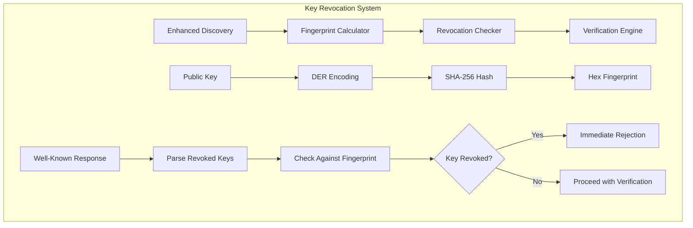
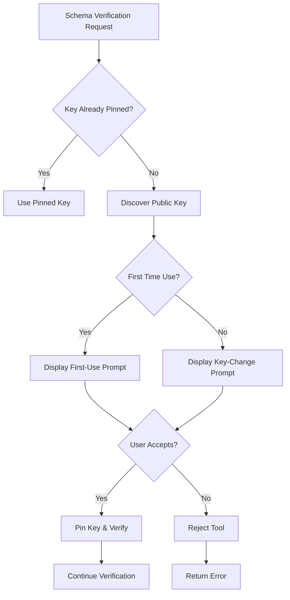
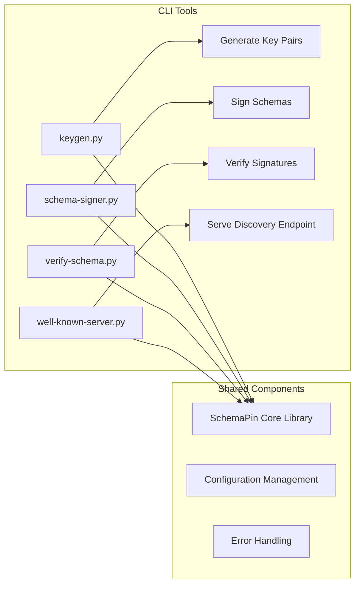
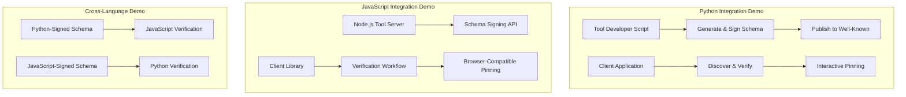
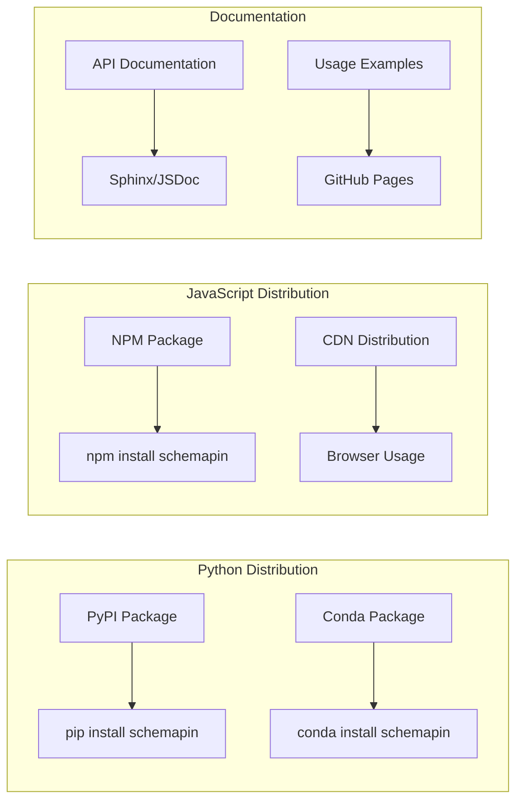

# SchemaPin Enhancement Implementation Plan

## Executive Summary

This document outlines a comprehensive implementation plan for enhancing the SchemaPin protocol with key revocation capabilities, interactive key pinning, standalone CLI tools, integration demos, and package distribution. The plan prioritizes security-critical features first while maintaining backward compatibility and cross-language interoperability.

## Current State Analysis

The SchemaPin project already has a solid foundation with:
- ✅ Core cryptographic operations (ECDSA P-256, SHA-256)
- ✅ Schema canonicalization and signing
- ✅ Public key discovery via `.well-known` endpoints
- ✅ Basic key pinning with TOFU mechanism
- ✅ Cross-language compatibility (Python & JavaScript)
- ✅ Comprehensive test suites

## Proposed Enhancements

### 1. Key Revocation Implementation (Priority 1)
### 2. Interactive Key Pinning (Priority 2)
### 3. Standalone CLI Tools (Priority 3)
### 4. Integration Demo & Examples (Priority 4)
### 5. Package Management & Distribution (Priority 5)

---

## Phase 1: Key Revocation Implementation

### Technical Specification Updates

**Schema Version Upgrade**: `1.0` → `1.1`

**Enhanced `.well-known/schemapin.json` Format**:
```json
{
  "schema_version": "1.1",
  "developer_name": "Example Corp Tools",
  "public_key_pem": "-----BEGIN PUBLIC KEY-----\n...current_key...\n-----END PUBLIC KEY-----",
  "revoked_keys": [
    "sha256:af01b2c3d4e5f6789abcdef0123456789abcdef0123456789abcdef0123456789",
    "sha256:c9b2a1f6e5d4c3b2a1f0e9d8c7b6a5f4e3d2c1b0a9f8e7d6c5b4a3f2e1d0c9b8"
  ],
  "contact": "security@example.com"
}
```

### Implementation Components



### Core Changes Required

1. **Fingerprint Generation**:
   - Add `calculate_key_fingerprint()` method to crypto modules
   - SHA-256 hash of DER-encoded public key bytes
   - Format: `sha256:hexstring`

2. **Enhanced Discovery**:
   - Update `PublicKeyDiscovery` to handle `revoked_keys` array
   - Backward compatibility with schema version 1.0
   - Validation of revocation list format

3. **Revocation Checking**:
   - New `check_key_revocation()` method
   - Integration into verification workflow
   - Clear error messages for revoked keys

4. **Schema Version Handling**:
   - Support both 1.0 and 1.1 formats
   - Graceful degradation for older endpoints

### Implementation Details

#### Python Implementation
```python
# New methods in crypto.py
class KeyManager:
    @classmethod
    def calculate_key_fingerprint(cls, public_key: EllipticCurvePublicKey) -> str:
        """Calculate SHA-256 fingerprint of public key."""
        der_bytes = public_key.public_bytes(
            encoding=serialization.Encoding.DER,
            format=serialization.PublicFormat.SubjectPublicKeyInfo
        )
        fingerprint = hashlib.sha256(der_bytes).hexdigest()
        return f"sha256:{fingerprint}"

# Enhanced discovery.py
class PublicKeyDiscovery:
    @classmethod
    def check_key_revocation(cls, public_key_pem: str, revoked_keys: List[str]) -> bool:
        """Check if a public key is in the revocation list."""
        public_key = KeyManager.load_public_key_pem(public_key_pem)
        fingerprint = KeyManager.calculate_key_fingerprint(public_key)
        return fingerprint in revoked_keys
```

#### JavaScript Implementation
```javascript
// New methods in crypto.js
class KeyManager {
    static calculateKeyFingerprint(publicKey) {
        const der = publicKey.export({ type: 'spki', format: 'der' });
        const hash = crypto.createHash('sha256').update(der).digest('hex');
        return `sha256:${hash}`;
    }
}

// Enhanced discovery.js
class PublicKeyDiscovery {
    static checkKeyRevocation(publicKeyPem, revokedKeys) {
        const publicKey = KeyManager.loadPublicKeyPem(publicKeyPem);
        const fingerprint = KeyManager.calculateKeyFingerprint(publicKey);
        return revokedKeys.includes(fingerprint);
    }
}
```

---

## Phase 2: Interactive Key Pinning

### User Experience Design



### Interactive Prompt System

**Core Components**:
1. **Prompt Interface**: Abstract base class for UI-agnostic prompts
2. **Console Implementation**: Rich console-based prompts for examples
3. **Key Information Display**: Fingerprints, developer info, domain details
4. **Decision Logging**: Audit trail of user decisions

### Implementation Details

#### Prompt Interface Design
```python
# New module: pinning_prompts.py
from abc import ABC, abstractmethod
from typing import Dict, Any, Optional

class KeyPinningPrompt(ABC):
    @abstractmethod
    def prompt_first_use(self, tool_id: str, domain: str, 
                        key_fingerprint: str, developer_info: Dict[str, str]) -> bool:
        """Prompt user for first-time key pinning."""
        pass
    
    @abstractmethod
    def prompt_key_change(self, tool_id: str, domain: str,
                         old_fingerprint: str, new_fingerprint: str,
                         developer_info: Dict[str, str]) -> bool:
        """Prompt user for key change confirmation."""
        pass

class ConsoleKeyPinningPrompt(KeyPinningPrompt):
    def prompt_first_use(self, tool_id: str, domain: str, 
                        key_fingerprint: str, developer_info: Dict[str, str]) -> bool:
        print(f"\n🔐 NEW KEY DETECTED for tool '{tool_id}'")
        print("\nTool Information:")
        print(f"  Domain:     {domain}")
        print(f"  Developer:  {developer_info.get('developer_name', 'Unknown')}")
        print(f"  Contact:    {developer_info.get('contact', 'N/A')}")
        print("\nKey Details:")
        print(f"  Fingerprint: {key_fingerprint}")
        print("\n⚠️  This is the first time you're using this tool.")
        
        while True:
            response = input("Do you want to trust and pin this key? (yes/no): ").lower().strip()
            if response in ['yes', 'y']:
                return True
            elif response in ['no', 'n']:
                return False
            print("Please answer 'yes' or 'no'")
```

#### Integration with Verification Workflow
```python
# Enhanced utils.py
class SchemaVerificationWorkflow:
    def __init__(self, pinning_db_path: Optional[str] = None, 
                 prompt_handler: Optional[KeyPinningPrompt] = None):
        self.pinning = KeyPinning(pinning_db_path)
        self.discovery = PublicKeyDiscovery()
        self.prompt_handler = prompt_handler or ConsoleKeyPinningPrompt()
    
    def verify_schema_interactive(self, schema: Dict[str, Any], signature_b64: str, 
                                 tool_id: str, domain: str) -> Dict[str, Any]:
        """Verify schema with interactive key pinning prompts."""
        # Implementation with interactive prompts
        pass
```

---

## Phase 3: Standalone CLI Tools

### Tool Suite Architecture



### Individual Tools

#### 1. `keygen.py` - Key Generation Utility
```bash
# Usage examples
python -m schemapin.tools.keygen --output-dir ./keys --developer-name "Example Corp"
python -m schemapin.tools.keygen --format well-known --contact security@example.com
```

**Features**:
- Generate ECDSA P-256 key pairs
- Export in PEM format
- Create `.well-known` response templates
- Key fingerprint calculation and display

#### 2. `schema-signer.py` - Schema Signing Tool
```bash
# Usage examples
python -m schemapin.tools.schema_signer --schema schema.json --key private.pem --output signed_schema.json
python -m schemapin.tools.schema_signer --batch-dir ./schemas --key private.pem
```

**Features**:
- Sign individual schema files
- Batch signing capabilities
- Integration with CI/CD pipelines
- Signature verification before output

#### 3. `verify-schema.py` - Verification Utility
```bash
# Usage examples
python -m schemapin.tools.verify_schema --schema schema.json --signature sig.b64 --domain example.com
python -m schemapin.tools.verify_schema --signed-schema signed_schema.json --interactive
```

**Features**:
- Standalone verification utility
- Support for local and remote keys
- Interactive key pinning mode
- Detailed verification reports

#### 4. `well-known-server.py` - Development Server
```bash
# Usage examples
python -m schemapin.tools.well_known_server --key-file public.pem --port 8080
python -m schemapin.tools.well_known_server --config server_config.json --https
```

**Features**:
- Simple HTTP server for testing
- Configurable endpoints
- HTTPS support
- Hot-reload for development

### CLI Implementation Structure

```python
# tools/cli_base.py
import argparse
import sys
from abc import ABC, abstractmethod

class CLITool(ABC):
    def __init__(self):
        self.parser = argparse.ArgumentParser(description=self.get_description())
        self.setup_arguments()
    
    @abstractmethod
    def get_description(self) -> str:
        pass
    
    @abstractmethod
    def setup_arguments(self):
        pass
    
    @abstractmethod
    def run(self, args) -> int:
        pass
    
    def main(self):
        args = self.parser.parse_args()
        try:
            return self.run(args)
        except Exception as e:
            print(f"Error: {e}", file=sys.stderr)
            return 1

# tools/keygen.py
class KeyGenTool(CLITool):
    def get_description(self) -> str:
        return "Generate ECDSA P-256 key pairs for SchemaPin"
    
    def setup_arguments(self):
        self.parser.add_argument('--output-dir', default='.', 
                               help='Output directory for key files')
        self.parser.add_argument('--developer-name', required=True,
                               help='Developer or organization name')
        # Additional arguments...
```

---

## Phase 4: Integration Demo & Examples

### Demo Architecture



### Demo Components

#### 1. Complete Workflow Demo
**File**: `examples/complete_workflow_demo.py`
```python
#!/usr/bin/env python3
"""
Complete SchemaPin workflow demonstration including:
- Key generation and management
- Schema signing
- Public key publishing
- Client verification with interactive pinning
- Key rotation and revocation scenarios
"""

def demonstrate_key_generation():
    """Show key pair generation and well-known setup."""
    pass

def demonstrate_schema_signing():
    """Show schema signing workflow."""
    pass

def demonstrate_client_verification():
    """Show client verification with interactive prompts."""
    pass

def demonstrate_key_revocation():
    """Show key revocation scenario."""
    pass

if __name__ == "__main__":
    print("🧷 SchemaPin Complete Workflow Demo")
    demonstrate_key_generation()
    demonstrate_schema_signing()
    demonstrate_client_verification()
    demonstrate_key_revocation()
```

#### 2. Cross-Language Compatibility Demo
**Files**: 
- `examples/cross_language_demo/python_signer.py`
- `examples/cross_language_demo/javascript_verifier.js`
- `examples/cross_language_demo/compatibility_test.py`

#### 3. Real-World Integration Examples
- **MCP Server Integration**: Example MCP server with SchemaPin verification
- **AI Agent Tool Verification**: Sample AI agent with schema validation
- **CI/CD Pipeline Integration**: GitHub Actions workflow for schema signing

---

## Phase 5: Package Management & Distribution

### Distribution Strategy



### Package Features

#### 1. Python Package Enhancement
**Enhanced `setup.py`**:
```python
from setuptools import setup, find_packages

setup(
    name="schemapin",
    version="1.1.0",
    description="Cryptographic schema integrity verification for AI tools",
    long_description=open("README.md").read(),
    long_description_content_type="text/markdown",
    author="ThirdKey",
    author_email="jascha@thirdkey.ai",
    url="https://github.com/thirdkey/schemapin",
    packages=find_packages(),
    install_requires=[
        "cryptography>=41.0.0",
        "requests>=2.31.0",
    ],
    extras_require={
        "dev": ["pytest>=7.0.0", "ruff>=0.1.0", "bandit>=1.7.0"],
        "cli": ["click>=8.0.0", "rich>=13.0.0"],
    },
    entry_points={
        "console_scripts": [
            "schemapin-keygen=schemapin.tools.keygen:main",
            "schemapin-sign=schemapin.tools.schema_signer:main",
            "schemapin-verify=schemapin.tools.verify_schema:main",
            "schemapin-server=schemapin.tools.well_known_server:main",
        ],
    },
    classifiers=[
        "Development Status :: 4 - Beta",
        "Intended Audience :: Developers",
        "License :: OSI Approved :: MIT License",
        "Programming Language :: Python :: 3",
        "Programming Language :: Python :: 3.8",
        "Programming Language :: Python :: 3.9",
        "Programming Language :: Python :: 3.10",
        "Programming Language :: Python :: 3.11",
        "Topic :: Security :: Cryptography",
        "Topic :: Software Development :: Libraries :: Python Modules",
    ],
    python_requires=">=3.8",
)
```

#### 2. JavaScript Package Enhancement
**Enhanced `package.json`**:
```json
{
  "name": "schemapin",
  "version": "1.1.0",
  "description": "Cryptographic schema integrity verification for AI tools",
  "main": "src/index.js",
  "type": "module",
  "exports": {
    ".": "./src/index.js",
    "./core": "./src/core.js",
    "./crypto": "./src/crypto.js",
    "./discovery": "./src/discovery.js",
    "./pinning": "./src/pinning.js",
    "./utils": "./src/utils.js",
    "./tools": "./src/tools/index.js"
  },
  "bin": {
    "schemapin-keygen": "./bin/keygen.js",
    "schemapin-sign": "./bin/schema-signer.js",
    "schemapin-verify": "./bin/verify-schema.js",
    "schemapin-server": "./bin/well-known-server.js"
  },
  "scripts": {
    "test": "node --test tests/*.test.js",
    "test:watch": "node --test --watch tests/*.test.js",
    "docs": "jsdoc -c jsdoc.conf.json",
    "lint": "eslint src/ tests/",
    "build": "rollup -c rollup.config.js"
  },
  "keywords": [
    "cryptography",
    "schema",
    "verification",
    "ecdsa",
    "ai-tools",
    "security",
    "mcp",
    "digital-signatures"
  ],
  "author": "ThirdKey",
  "license": "MIT",
  "repository": {
    "type": "git",
    "url": "https://github.com/thirdkey/schemapin"
  },
  "engines": {
    "node": ">=18.0.0"
  },
  "dependencies": {},
  "devDependencies": {
    "eslint": "^8.0.0",
    "jsdoc": "^4.0.0",
    "rollup": "^3.0.0"
  }
}
```

#### 3. Documentation Generation
- **Python**: Sphinx with autodoc for API documentation
- **JavaScript**: JSDoc with custom templates
- **GitHub Pages**: Automated documentation deployment
- **Examples Repository**: Separate repository with comprehensive examples

---

## Implementation Timeline

### Phase 1: Key Revocation (Weeks 1-2)
- [ ] Update technical specification to v1.1
- [ ] Implement fingerprint calculation in both languages
- [ ] Enhance discovery modules for revocation checking
- [ ] Update verification workflows with revocation logic
- [ ] Add comprehensive test coverage for revocation scenarios
- [ ] Update examples and documentation

### Phase 2: Interactive Pinning (Weeks 3-4)
- [ ] Design and implement prompt interface abstraction
- [ ] Create console-based prompt implementations
- [ ] Integrate interactive prompts with verification workflows
- [ ] Add user decision logging and audit capabilities
- [ ] Create interactive examples and demos
- [ ] Update documentation with interactive usage patterns

### Phase 3: CLI Tools (Weeks 5-6)
- [ ] Develop standalone CLI utilities with comprehensive help
- [ ] Implement configuration management and error handling
- [ ] Add batch processing capabilities for enterprise use
- [ ] Create integration tests for CLI tool workflows
- [ ] Package CLI tools with main library distributions

### Phase 4: Integration Demo (Week 7)
- [ ] Create comprehensive demo applications
- [ ] Validate cross-language compatibility with extensive testing
- [ ] Develop real-world scenario examples and tutorials
- [ ] Conduct performance benchmarking and optimization
- [ ] Generate comprehensive documentation and tutorials

### Phase 5: Distribution (Week 8)
- [ ] Prepare and test packages for PyPI and NPM
- [ ] Generate comprehensive API documentation
- [ ] Create installation guides and usage tutorials
- [ ] Set up CI/CD pipelines for automated releases
- [ ] Develop community documentation and contribution guides

---

## Technical Challenges & Mitigation Strategies

### Challenge 1: Backward Compatibility
**Risk**: Breaking existing implementations with v1.1 schema changes
**Mitigation**: 
- Implement graceful degradation for v1.0 endpoints
- Add feature detection in discovery modules
- Provide comprehensive migration documentation
- Maintain parallel support for both versions during transition

### Challenge 2: Interactive Prompt Integration
**Risk**: Different applications requiring different UI approaches
**Mitigation**:
- Design abstract prompt interface for maximum flexibility
- Provide multiple reference implementations (console, JSON-based)
- Create clear integration guidelines for custom implementations
- Ensure prompt system is completely optional for automated environments

### Challenge 3: Cross-Language Fingerprint Consistency
**Risk**: Different DER encoding or hashing implementations producing inconsistent results
**Mitigation**:
- Develop extensive cross-language test vectors
- Implement reference test cases with known fingerprints
- Use standardized cryptographic libraries with proven compatibility
- Add automated cross-language compatibility testing to CI/CD

### Challenge 4: CLI Tool Distribution and Dependencies
**Risk**: Complex installation and dependency management across platforms
**Mitigation**:
- Design self-contained CLI tools with minimal dependencies
- Provide clear installation documentation for all platforms
- Create comprehensive error handling and user-friendly messages
- Offer alternative installation methods (pip, npm, standalone binaries)

---

## Success Criteria

### Functional Requirements
1. **Key Revocation**: Immediate rejection of schemas signed with revoked keys across all implementations
2. **Interactive Pinning**: Clear, informative user prompts displaying security-relevant details
3. **CLI Tools**: Fully functional standalone utilities for all major SchemaPin operations
4. **Integration**: Working demonstrations showing real-world usage patterns and scenarios
5. **Distribution**: Easy installation via standard package managers with comprehensive documentation

### Technical Requirements
1. **Compatibility**: 100% cross-language signature verification and fingerprint consistency
2. **Security**: No regression in existing security guarantees, enhanced protection against key compromise
3. **Performance**: Verification operations complete within acceptable time limits for interactive use
4. **Reliability**: Comprehensive error handling and graceful degradation for network failures
5. **Maintainability**: Clean, well-documented code with comprehensive test coverage

### User Experience Requirements
1. **Usability**: Intuitive CLI interfaces with helpful error messages and guidance
2. **Documentation**: Complete API documentation with practical examples and tutorials
3. **Integration**: Clear integration paths for different application architectures
4. **Security Awareness**: User prompts that enable informed security decisions
5. **Flexibility**: Support for both automated and interactive usage patterns

---

## Conclusion

This implementation plan provides a comprehensive roadmap for enhancing SchemaPin with critical security features while maintaining its core principles of simplicity, security, and cross-language compatibility. The phased approach ensures steady progress with early delivery of the most important security enhancements, followed by tooling and distribution improvements that will facilitate broader adoption.

The plan prioritizes the key revocation feature as the highest priority security enhancement, followed by interactive key pinning to improve the user experience around trust decisions. The subsequent phases focus on developer tooling and ecosystem development to support real-world deployment and adoption.

By following this plan, SchemaPin will evolve from a solid cryptographic foundation into a comprehensive, production-ready system for ensuring the integrity and authenticity of AI tool schemas in an increasingly complex and security-conscious environment.